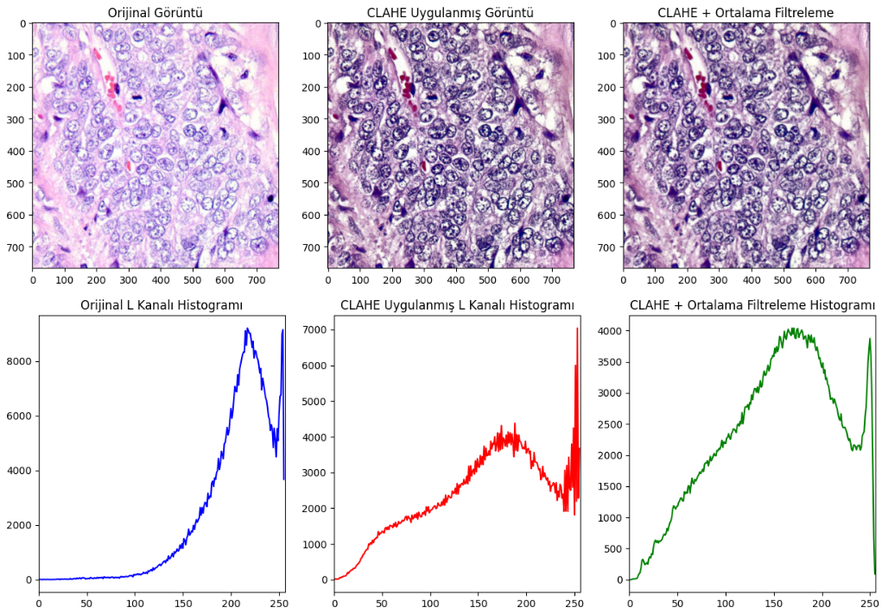

### 📊 Görüntü İşleme Sonuçları

Aşağıdaki görselde orijinal görüntüye sırasıyla **CLAHE (Contrast Limited Adaptive Histogram Equalization)** ve ardından **ortalama filtreleme (mean filtering)** uygulanmıştır.

- CLAHE işlemi ile kontrast artırılmıştır (`clip limit = 2.0`).
- Daha sonra 3x3 kernel boyutunda bir ortalama filtre uygulanarak görüntüdeki gürültü azaltılmıştır.

Alt kısımdaki grafiklerde her bir aşamadan sonra elde edilen **L kanalı histogramları** sunulmuştur:

- **X ekseni:** Piksel parlaklık seviyeleri (0–255 arası).
- **Y ekseni:** İlgili parlaklık seviyesine sahip piksel sayısı (frekans).

---

### 📊 Image Processing Results

The figure below illustrates the enhancement process applied to the original histopathological image using **CLAHE (Contrast Limited Adaptive Histogram Equalization)** followed by **mean filtering**.

- CLAHE was applied to enhance image contrast (`clip limit = 2.0`).
- A 3×3 mean filter was used to reduce noise.

In the bottom row, **L channel histograms** corresponding to each step are displayed:

- **X-axis:** Pixel intensity levels (ranging from 0 to 255).
- **Y-axis:** Number of pixels at each intensity level (frequency).

