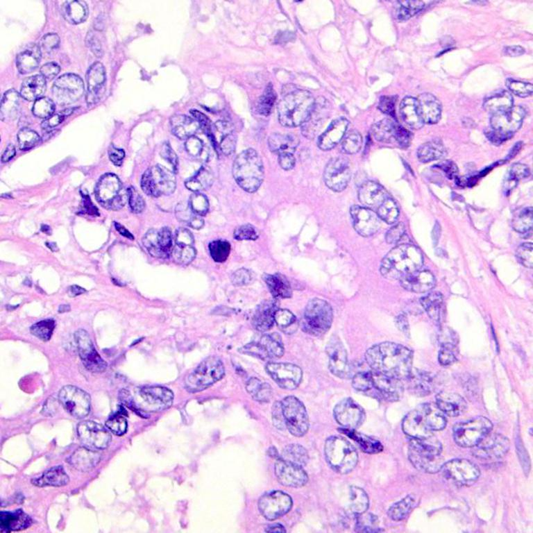
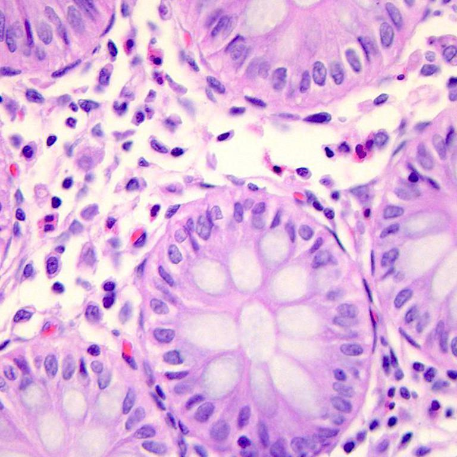

# DeepColon

Bu proje histopatolojik görüntüler kullanılarak **Makine Öğrenmesi ve Derin Öğrenme yöntemleriyle kolon kanserinin tespitini** amaçlamaktadır. 

## 📂 Veri Seti

Projede kullanılan veri seti, **Kaggle** üzerinde yer alan [LC25000 – Labeled Colon and Lung Histopathological Images](https://www.kaggle.com/datasets/andrewmvd/lung-and-colon-cancer-histopathological-images) veri setidir. Veri seti; kolon ve akciğer doku görüntülerinden oluşmaktadır. Biz sadece **kolon kanseri (colon cancer)** ve **sağlıklı kolon dokusu (colon healthy)** görüntülerini kullandık.

### 🔬 Örnek Görseller

Aşağıda kolon kanserli bir dokuya ve sağlıklı bir dokuya ait örnek görseller yer almaktadır:

<table>
  <tr>
    <td><strong>Kolon Kanseri</strong></td>
    <td><strong>Sağlıklı Doku</strong></td>
  </tr>
  <tr>
    <td></td>
    <td></td>
  </tr>
</table>

## ⚙️ Proje Süreci ve Kullanılan Yöntemler

### 1. Görüntü Önişleme  
- **CLAHE (Contrast Limited Adaptive Histogram Equalization)** yöntemi ile kontrast iyileştirilmiştir. 
- **Ortalama filtreleme** ile gürültü giderimi sağlandı.

### 2. Özellik Çıkarımı  
Görüntülerden çeşitli yöntemlerle sayısal özellikler çıkarılarak sınıflandırma sürecine hazır hale getirildi. Geleneksel yöntemlerden **LBP (Local Binary Patterns)** kullanılarak **18 özellik**, **GoogleNet** modelinden **1024 özellik**, **ResNet18** modelinden ise **512 özellik** elde edilmiştir. Bu üç kaynaktan gelen toplam **1554 özellik** birleştirilmiştir ve güçlü bir sınıflandırma için kullanılmıştır.

### 3. Sınıflandırma  
Elde edilen birleşik özellik vektörleri **Random Forest** algoritmasına verilerek sınıflandırma yapılmıştır. Model, görüntüleri **kolon kanseri dokusu** ya da **sağlıklı doku** olarak başarıyla sınıflandırmış ve en yüksek doğruluk oranı olarak **%99.76** elde edilmiştir.

### 4. Masaüstü Uygulama  
Python ile geliştirilen masaüstü uygulama sayesinde kullanıcılar kendi görüntülerini yükleyerek anında test gerçekleştirebilmektedir. Uygulama yüklenen görseli analiz edip sınıflandırma sonucunu kullanıcıya sunmaktadır.

🖥️ **Masaüstü Uygulama GitHub Reposu:**  
  🔗 [https://github.com/beyzataylann/DeepColon](https://github.com/beyzataylann/DeepColon)

